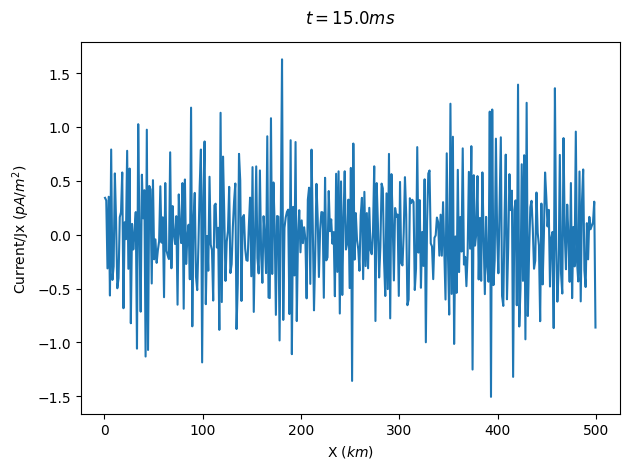

# EPOCH 使用说明

## 安装EPOCH

首先在终端运行如下命令，将EPOCH源代码从GitHub仓库中下载到本地:

```git
git clone --recursive https://github.com/Warwick-Plasma/epoch.git
```

"--recursive"很重要，因为其中的子文件夹 SDF的下载需要它。如果下载该子文件夹失败，可使用如下命令单独下载

```
git clone --recursive https://github.com/Warwick-Plasma/SDF.git
```

## 编译代码

在epoch文件夹下有3个子文件夹，epoch1d,epoch2d,epoch3d分别表示1维，2维和三维仿真程序，每个子文件夹下都包含一个"Makefile"，我们将利用它对代码进行编译。首先进入其中一个子文件夹，如epoch2d,运行

```
make COMPILER=gfortran -j4
```

其中的数字4可以根据电脑的性能适当增加，以加快编译。

编译结束后，在子文件夹中会出现文件夹bin，其中包含二进制文件epoch2d.

## 运行代码

EPOCH默认使用输入文件input.deck，epoch2d中example_decks包含了多个示例文件，如bremsstrahlung.deck。复制其内容并命名文件为input.deck，使用如下代码运行：

```
mpirun -np 7 ./bin/epoch2d <<< ./example_decks
```

其中默认将input.deck放在了./example_decks目录下。

如果尝试复制bremsstrahlung.deck中的内容到input.deck并运行，会出现报错：

```
WARNING *** Input deck line number 130 Cannot identify species "Photon" as "brem_photon" because compiler option -DPHOTONS has not been set.
*** ERROR ***
 Unable to set "use_bremsstrahlung=T" in the "bremsstrahlung" block.
 Please recompile with the -DBREMSSTRAHLUNG preprocessor flag.
```

此时可以编辑Makefile中

```
# Set pre-processor defines
DEFINES := $(DEFINE)
```

改为

```
# Set pre-processor defines
DEFINES := $(DEFINE) $(D)BREMSSTRAHLUNG $(D)PHOTONS
```

这会启用轫致辐射（`BREMSSTRAHLUNG`）和光子支持（`PHOTONS`）。

之后重新编译

```
make clean
make COMPILER=gfortran -j4
```

即可。

### 代码解读

#### bremsstrahlung.deck

这段代码是一个用于模拟物理过程的输入文件，它定义了模拟的参数、物理过程、边界条件、粒子种类以及输出设置。以下是对各部分的解释：

**1. `control` 部分**

控制模拟的全局参数：

- `nx`, `ny`: 定义网格点的数量，分别在 x 和 y 方向上。
- `npart`: 粒子总数，计算为 `nx * ny * 128`。
- `nsteps`: 最大迭代次数，`-1` 表示运行到模拟结束。
- `t_end`: 模拟的最终时间。
- `x_min`, `x_max`, `y_min`, `y_max`: 定义模拟区域的空间范围。
- `dt_multiplier`: 时间步长的缩放因子。

**2. `bremsstrahlung` 部分**

定义与轫致辐射（Bremsstrahlung）相关的参数：

- `use_bremsstrahlung`: 是否启用轫致辐射。
- `start_time`: 轫致辐射开始的时间。
- `produce_photons`: 是否生成并跟踪光子。
- `photon_energy_min`: 跟踪光子的最小能量。
- `photon_weight`: 光子的宏粒子权重，用于调整采样。
- `photon_dynamics`: 是否模拟光子的运动（关闭时仅记录生成位置）。
- `use_bremsstrahlung_recoil`: 是否考虑电子发射光子后的反冲。
- `use_plasma_screening`: 是否考虑等离子体屏蔽效应。

**3. `boundaries` 部分**

定义边界条件：

- `bc_x_min`, `bc_x_max`: x 方向的边界条件，设置为 `simple_laser`。
- `bc_y_min`, `bc_y_max`: y 方向的边界条件，设置为 `periodic`（周期性边界）。

**4. `species` 部分**

定义了三种粒子种类：

1. **`Electron_Beam`（电子束）**:
   - `frac`: 占粒子总数的比例。
   - `rho`: 定义电子束的密度分布。
   - `drift_x`: 电子束的漂移动量。
   - `identify:electron`: 标记为电子，用于轫致辐射计算。
2. **`Aluminium`（铝靶）**:
   - `atomic_number`: 原子序数（13）。
   - `mass`: 原子质量。
   - `rho`: 铝的密度。
   - `immobile`: 设置为不可移动。
3. **`Photon`（光子）**:
   - `npart`: 初始光子数为 0。
   - `identify:brem_photon`: 标记为轫致辐射光子。

**5. `output` 部分**

定义输出设置：

- `dt_snapshot`: 每隔多少时间步输出一次快照。
- `full_dump_every`: 每隔多少快照进行完整输出。
- `particles`, `px`, `py`, `pz`: 定义输出的粒子属性。
- `grid`: 定义网格上的输出属性，如电场、磁场、密度等。

**6. `probe` 部分**

定义探针，用于采样特定位置的粒子信息：

- `name`: 探针名称。
- `point`: 探针所在的点。
- `normal`: 探针的法向量。
- `include_species`: 指定采样的粒子种类（如 `Electron_Beam`）。
- `ek_min`, `ek_max`: 采样的能量范围。

**总结**

这段代码配置了一个模拟电子束与铝靶相互作用并产生轫致辐射的物理过程。它详细定义了模拟的空间范围、时间步长、粒子种类、边界条件以及输出设置，是一个典型的粒子模拟输入文件。

#### cone.deck

**1. `control` 部分**

控制模拟的全局参数：

- `nx`, `ny`: 定义网格点的数量，分别在 x 和 y 方向上（250×250 的网格）。
- `nparticles`: 粒子总数，计算为 `nx * ny * 8`。
- `t_end`: 模拟的最终时间，设置为 50 飞秒（`50 * femto`）。
- `x_min`, `x_max`, `y_min`, `y_max`: 定义模拟区域的空间范围，单位为微米（`micron`）。这里的范围是一个对称的正方形区域，`x_min = -10 * micron`，`x_max = 10 * micron`，`y_min = -10 * micron`，`y_max = 10 * micron`。

**2. `boundaries` 部分**

定义边界条件：

- `bc_x_min`: x 方向的最小边界设置为 `simple_laser`，表示激光入射。
- `bc_x_max`: x 方向的最大边界设置为 `simple_outflow`，表示粒子和能量可以自由流出。
- `bc_y_min`, `bc_y_max`: y 方向的边界设置为 `periodic`，表示周期性边界条件。

------

**3. `constant` 部分**

定义了一些物理常量和几何参数：

- `lambda`: 激光波长，1.06 微米。
- `omega`: 激光的角频率，计算为 `2 * pi * c / lambda`。
- `den_cone`: 圆锥区域的粒子密度，设置为 4 倍的临界密度（`critical(omega)`）。
- `th`: 圆锥的半厚度，0.5 微米。
- `ri`, `ro`: 定义圆锥的内半径和外半径，分别为 `abs(x - 5*micron) - sqrt(2.0) * th` 和 `abs(x - 5*micron) + sqrt(2.0) * th`。
- `xi`, `xo`: 定义圆锥的 x 方向范围，分别为 `3*micron - th` 和 `3*micron + th`。
- `r`: 定义 y 方向的径向距离，`r = sqrt(y^2)`。

------

**4. `species` 部分**

定义了两种粒子种类：**质子（proton）** 和 **电子（electron）**。

**质子（proton）**

- `charge`: 电荷为 +1。
- `mass`: 质量为 1836.2（相对于电子质量）。
- `fraction`: 占粒子总数的 50%。
- number_density: 定义质子的密度分布：
  - 在圆锥区域内（`ri < r < ro`）和 x 的范围内（`xi < x < xo`），密度为 `den_cone`。
  - 超出这些范围的区域，密度为 0。

**电子（electron）**

- `charge`: 电荷为 -1。
- `mass`: 质量为 1（电子质量）。
- `fraction`: 占粒子总数的 50%。
- `number_density`: 与质子的密度相同（`number_density(proton)`）。

------

**5. `laser` 部分**

定义激光参数：

- `boundary`: 激光从 `x_min` 边界入射。
- `amp`: 激光的振幅，`1e13`。
- `lambda`: 激光波长，使用前面定义的 `lambda`。
- `profile`: 激光的空间分布，设置为高斯分布（`gauss(r, 0.0, 2.5*micron)`），中心在 0，标准差为 2.5 微米。

------

**6. `output_global` 部分**

全局输出设置：

- `force_final_to_be_restartable`: 设置为 `T`，表示模拟结束时的状态可以用于重启。

------

**7. `output` 部分**

定义了两种输出模式：`normal` 和 `large`。

**`normal` 输出**

- `dt_snapshot`: 每 1 飞秒输出一次。
- 输出的网格属性包括：
  - `ey`: y 方向的电场。
  - `average_particle_energy`: 平均粒子能量。
  - `number_density`: 粒子数密度（按种类）。
  - `temperature`: 温度（按种类）。
- 扩展输出包括分布函数（`distribution_functions`）。

**`large` 输出**

- `dt_snapshot`: 每 10 飞秒输出一次。
- 输出的粒子属性包括：
  - `particles`: 粒子位置。
  - `particle_weight`: 粒子权重。
  - `charge_density`: 电荷密度。

------

**8. `dist_fn` 部分**

定义了两个分布函数输出：

1. **`x_px` 分布函数**
   - 维度：2D。
   - 方向：x 和 px（动量）。
   - 包含的粒子种类：电子和质子。
2. **`x_px_py` 分布函数**
   - 维度：3D。
   - 方向：x、px 和 py（动量）。
   - 包含的粒子种类：电子和质子。

------

**总结**

这段代码配置了一个模拟激光与圆锥形等离子体相互作用的物理过程。它详细定义了模拟的空间范围、粒子种类、激光参数、边界条件以及输出设置。通过这些配置，可以研究激光与等离子体相互作用的动力学行为，例如粒子加速、能量分布等。

#### filter.deck

**1. `control` 部分**

控制模拟的全局参数：

- `nx`, `ny`: 定义网格点的数量，分别在 x 和 y 方向上（100×100 的网格）。
- `t_end`: 模拟的最终时间，设置为 0.15（单位未明确，可能是秒）。
- `x_min`, `x_max`, `y_min`, `y_max`: 定义模拟区域的空间范围，x 和 y 的范围均为 0 到 5.0e5。
- `smooth_currents`: 是否对电流进行平滑处理，设置为 `T`（启用）。
- `smooth_iterations`: 平滑处理的迭代次数，设置为 4。
- `smooth_strides`: 平滑的步长，设置为 `auto`（自动计算）。

**2. `boundaries` 部分**

定义边界条件：

- `bc_x_min`, `bc_x_max`: x 方向的边界条件，设置为 `periodic`（周期性边界）。
- `bc_y_min`, `bc_y_max`: y 方向的边界条件，设置为 `periodic`（周期性边界）。

**3. `constant` 部分**

定义了一些物理常量：

- `drift_p`: 粒子的漂移动量，设置为 `2.5e-24`。
- `temperature`: 粒子的温度，设置为 273（可能是开尔文）。
- `dens`: 粒子的数密度，设置为 10。

**4. `species` 部分**

定义了两种粒子种类：**右向电子（Right）** 和 **左向电子（Left）**。

**右向电子（Right）**

- `name`: 粒子名称为 `Right`。
- `charge`: 电荷为 -1（电子）。
- `mass`: 质量为 1（电子质量）。
- `temperature_x`: x 方向的温度，使用前面定义的 `temperature`。
- `drift_px`: x 方向的漂移动量，设置为 `drift_p`。
- `number_density`: 数密度，使用前面定义的 `dens`。
- `nparticles`: 粒子总数，计算为 `nx * ny * 4`。

**左向电子（Left）**

- `name`: 粒子名称为 `Left`。
- `charge`: 电荷为 -1（电子）。
- `mass`: 质量为 1（电子质量）。
- `temperature_x`: x 方向的温度，使用前面定义的 `temperature`。
- `drift_px`: x 方向的漂移动量，设置为 `-drift_p`（与右向电子相反）。
- `number_density`: 数密度，使用前面定义的 `dens`。
- `nparticles`: 粒子总数，计算为 `nx * ny * 4`。

**5. `output` 部分**

定义输出设置：

- `name`: 输出名称为 `normal`。
- `dt_snapshot`: 每隔 `10.5e-3` 的模拟时间输出一次。
- `dump_last`: 是否在最后一次输出，设置为 `F`（关闭）。
- 输出的网格属性包括：
  - `grid`: 始终输出网格数据。
  - `ex`: 始终输出 x 方向的电场。
  - `jx`: 始终输出 x 方向的电流密度。
  - `charge_density`: 始终输出电荷密度。
  - `number_density`: 始终输出粒子数密度（按种类）。
- 扩展输出包括分布函数（`distribution_functions`）。

**6. `dist_fn` 部分**

定义了一个分布函数输出：

- `name`: 分布函数名称为 `x_px`。
- `ndims`: 分布函数的维度为 2D。
- `direction1`: 第一个方向为 `dir_x`（空间 x 方向）。
- `direction2`: 第二个方向为 `dir_px`（动量 px 方向）。
- `range1`: x 方向的范围（忽略，设置为 `(1, 1)`）。
- `range2`: px 方向的范围，设置为 `-5e-24` 到 `5e-24`。
- `resolution1`: x 方向的分辨率（忽略，设置为 1）。
- `resolution2`: px 方向的分辨率，设置为 200。
- `include_species`: 包含的粒子种类为 `Left` 和 `Right`。

**总结**

这段代码配置了一个模拟右向和左向电子在周期性边界条件下的相互作用的物理过程。它详细定义了模拟的空间范围、粒子种类、漂移动量、温度以及输出设置。通过这些配置，可以研究电子的漂移行为、电场分布、电流密度等物理现象。

## 可视化结果

EPOCH程序使用自描述文件格式SDF，SDF子文件夹中包含用于阅读和编写此类文件的例程，以及用于MATLAB，IDL，PYTHON和访问的读取器插件。

### Python

使用python可视化SDF文件，推荐在epoch文件夹下创建并启动虚拟环境：

```
python -m venv ./venv
source ./venv/bin/activate
```

之后就可以进入如下目录安装sdf模块：

```
cd ./SDF/utilities
pip install .
```

其他需要安装的模块可以直接通过pip安装。注意到上述目录下有一个文件夹sdf_helper，该模块无法通过pip安装，但可以通过将其所在路径添加到python环境变量中，从而import。下面新建visualize.ipynb

```
import sys
sys.path.append('/Your/Path/To/epoch/SDF/utilities')
import sdf_helper as sh
import numpy as np
import matplotlib.pyplot as plt
```

```
data = sh.getdata('./epoch1d/input/0010.sdf')
plt.ion()
sh.plot_auto(data.Current_Jx)
```



## 使用场景

EPOCH 是一个基于粒子-网格（Particle-in-Cell, PIC）方法的**等离子体物理模拟代码**，主要用于模拟高能量密度等离子体系统，广泛应用于激光-等离子体相互作用等领域。根据用户手册中的说明，EPOCH 能模拟以下物理场景：

#### **1.** **激光-等离子体相互作用**

EPOCH 的主要用途之一就是模拟超强激光与等离子体的相互作用，例如：

- 激光驱动的等离子体加速器（Laser Wakefield Acceleration, LWFA）
- 激光推动的靶面加热和电子喷射
- 激光聚变（Inertial Confinement Fusion）

#### **2.** **相对论性电子束与等离子体耦合**

可用于研究电子束传播过程中的不稳定性、束-等离子体相互作用等问题。

#### **3.** 等离子体中的微观不稳定性**

EPOCH 可以很好地模拟经典的等离子体不稳定性，如：

- 两流不稳定性（Two-stream instability）
- 脉冲-背景相互作用
- 电磁波与等离子体耦合

#### **4.** 电磁波传播与反射、吸收**

- Maxwell 方程通过 Yee 格子方法进行数值求解，可以用于电磁波在等离子体中的传播、反射、吸收研究。

#### **5.** 强场量子电动力学（QED）效应**

在高强激光场中，EPOCH 支持启用 QED 模块模拟如：

- 光子发射（如同步辐射）
- 正负电子对的产生（pair production）

#### **6.** 碰撞过程与辐射机制**

- 支持包括库仑碰撞、Bremsstrahlung 辐射等物理机制
- 可用于研究能量耗散、粒子热化过程等

#### **7.** 等离子体中粒子的分布演化**

通过配置 input.deck 文件中的粒子分布、温度、速度等参数，可以研究各种非热分布、空间不均匀性、温度梯度等对动力学行为的影响。

#### **8.** 自由定义粒子注入与移动窗格（Moving Window）**

- 可以模拟等离子体在移动框架下的行为（如激光在稀薄气体中传播）
- 支持粒子从边界注入，以及定义任意速度、密度、温度分布

### 激光打靶

